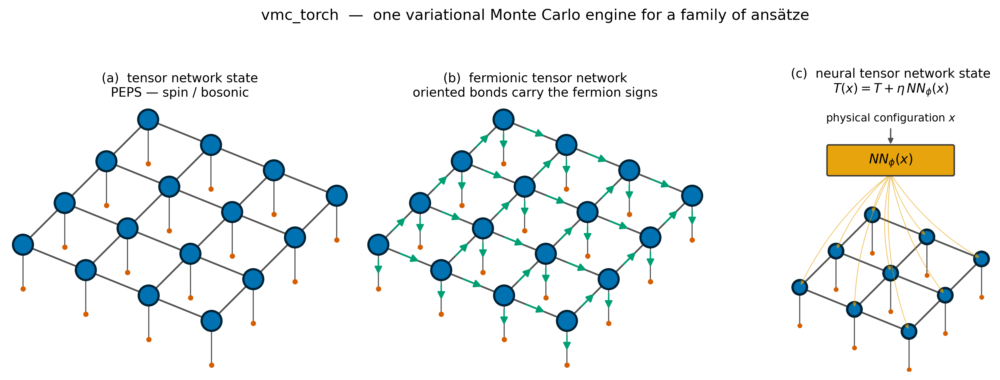

# ⚛️ vmc_torch: Flexible Variational Monte Carlo for Quantum Many-Body Systems with PyTorch

`vmc_torch` is a **scalable implementation of Variational Monte Carlo (VMC)** designed for studying the **ground-state properties** of quantum many-body lattice Hamiltonians with **flexible** variational wavefunction *Ansätze*.

Built upon **PyTorch**, this library offers great flexibility in choice of variational *Ansätze*, including Neural Quantum States (NQS) and Tensor Network States (TNS), and hybrid TN-NN models such as NN-fTNS [1].



A single Monte Carlo engine drives all of them: sample → local energies → log-derivatives → preconditioned update. Changing the *Ansatz* never changes the loop.

## Overview

### Key Features and Capabilities

* **Diverse Variational Ansätze Support:** Supports a wide spectrum of modern wavefunctions:
    * **Neural Quantum States (NQS):** Leveraging PyTorch's native capabilities for large-scale, trainable neural network models.
    * **Tensor Network States (TNS):** Integrates with TN libraries (`quimb`, `symmray`) for handling Matrix Product States (MPS), Projected Entangled Pair States (PEPS), and more, bosonic or fermionic.
    * **Neuralized fermionic TNS (NN-fTNS):** Hybrid TN-NN model that improves over both fermionic TNS and NQS, see [1] for details.
    * **Tensor Network Functions (TNF):** Function defined by tensor networks with arbitrary geometry. E.g. TNF derived from (1+1)D quantum circuit that supports volume-law entanglement structure, see [2] for details.
* **Fermionic symmetries built in:** Site tensors are `symmray` Z₂-graded block-sparse arrays, so fermionic anticommutation signs are handled by the tensor algebra itself rather than by an external Jordan–Wigner transformation.
* **GPU acceleration:** `torch.distributed` data-parallel sampling across GPUs, GPU-batched connected-element evaluation, and a `torch.export` + `torch.compile` path that fuses the `quimb` tensor-network contraction into CUDA kernels.
* **Massively Parallel VMC Sampling:** Utilizes **`mpi4py`** to distribute the Markov Chain Monte Carlo (MCMC) sampling process, suitable on high-performance computing (HPC) clusters.
* **HPC Ready:** Built for large-scale VMC calculations, suitable for deployment across **thousands of CPU cores** or multiple GPUs.
* **Auto-differentiation for Optimization:** Leverages PyTorch's automatic differentiation for efficient energy optimization with techniques like Stochastic Reconfiguration (SR), minSR, and other ML optimizers.

## 🚀 Installation

Requires **Python 3.10+**. The two tensor-network dependencies are tracked from git and are *not* installed automatically:

```bash
pip install -U git+https://github.com/jcmgray/quimb.git
pip install -U git+https://github.com/jcmgray/symmray.git
pip install -U git+https://github.com/sjdu10/vmc_torch.git
```

**Installing a local, editable development version:**

```bash
git clone https://github.com/sjdu10/vmc_torch.git
pip install --no-deps -U -e vmc_torch/
```

Optional extras: `mpi4py` for the CPU/MPI sampling path, `cotengra` for contraction-path optimization, and `scipy` for the exact-diagonalization reference used in the examples.

## 📖 Usage

### GPU tutorial notebook (start here)

[`examples/vmc_gpu_tutorial.ipynb`](./examples/vmc_gpu_tutorial.ipynb) is a step-by-step tutorial that optimizes a dense PEPS, a fermionic (Z₂) PEPS, and a neural fTNS on a single GPU.

### GPU script

[`examples/vmc_gpu_example_heis.py`](./examples/vmc_gpu_example_heis.py) is the standalone version of §2, with multi-GPU support:

```bash
python examples/vmc_gpu_example_heis.py                     # single GPU
torchrun --nproc_per_node=4 examples/vmc_gpu_example_heis.py  # 4 GPUs
```

Walkers are distributed across ranks; the energy statistics and the SR solve carry the necessary reductions, so no code changes are needed to scale out.

### CPU / MPI

For CPU clusters, `examples/vmc_run_example.py` runs VMC for the ground state of a `4x2` Fermi-Hubbard model (OBC) on a square lattice at half-filling using a Slater determinant:

```bash
cd ./examples
mpirun -np 10 python vmc_run_example.py
```

Feel free to substitute the number `10` with any number of MPI ranks you want to use.

The PEPS examples (`vmc_run_example_heis.py`, `vmc_run_example_Ising.py`) read a simple-update starting state, so run the matching `SU_*.py` script first to generate it.

## 📚 References

### Research Publication

This code is the result of the research detailed in:

[1] **"Neuralized Fermionic Tensor Networks for Quantum Many-Body Systems"** - Si-Jing Du, Ao Chen, and Garnet Kin-Lic Chan - [Phys. Rev. B 113, 085134](https://doi.org/10.1103/x8vl-qf14)

[2] **Tensor Network Computations That Capture Strict Variationality, Volume Law Behavior, and the Efficient Representation of Neural Network States** - Wen-Yuan Liu*, Si-Jing Du*, Ruojing Peng, Johnnie Gray and Garnet Kin-Lic Chan - [Phys. Rev. Lett. 133, 260404](https://doi.org/10.1103/PhysRevLett.133.260404)


### Citation

If you find this code useful, please consider citing it:

```bibtex
@software{vmc_torch,
  author = {Du, Si-Jing},
  title = {vmc\_torch: Flexible Variational Monte Carlo for Quantum Many-Body Systems with PyTorch},
  url = {https://github.com/sjdu10/vmc_torch},
  year = {2026}
}

@article{du2025neuralized,
  title = {Neuralized fermionic tensor networks for quantum many-body systems},
  author = {Du, Si-Jing and Chen, Ao and Chan, Garnet Kin-Lic},
  journal = {Phys. Rev. B},
  volume = {113},
  pages = {085134},
  year = {2026},
  doi = {10.1103/x8vl-qf14}
}
```

### Core Dependencies

`vmc_torch` builds on and interoperates with leading libraries in Tensor Networks and quantum many-body calculations:

[3] `symmray` - *Johnnie Gray* - https://github.com/jcmgray/symmray

[4] `quimb` - *Johnnie Gray* - https://github.com/jcmgray/quimb

## License

Apache License 2.0 — see [LICENSE](./LICENSE).
