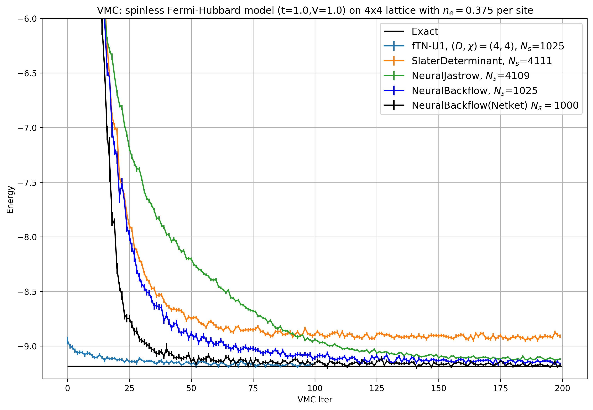

# vmc_torch

A quantum variational Monte Carlo (VMC) framework for general pytorch models. Currently is used for tensor network state VMC (bosonic and fermionic) with TNS (bosonic/fermionic) defined using Quimb and Symmray.

## Install

**Installing the latest version directly from github:**

```bash
pip install -U git+https://github.com/sjdu10/vmc_torch.git
```

**Installing a local, editable development version:**

```bash
git clone https://github.com/sjdu10/vmc_torch.git
pip install --no-deps -U -e vmc_torch/
```

## Usage

**Neural network state example:**

In `/examples`, there's an example script for running VMC on a `4x4` spinless Hubbard model using various neural network quantum states.
To run the code: 
```bash
cd ./examples
mpirun -np 10 python vmc_run_example.py
```
Feel free to substitute the number `10` with any number of MPI ranks you want to use.

One can generate VMC results like this:



## References
- "NetKet 3: Machine Learning Toolbox for Many-Body Quantum Systems" - *Filippo Vicentini and Damian Hofmann and Attila Szabó and Dian Wu and Christopher Roth and Clemens Giuliani and Gabriel Pescia and Jannes Nys and Vladimir Vargas-Calderón and Nikita Astrakhantsev and Giuseppe Carleo* - https://scipost.org/10.21468/SciPostPhysCodeb.7

- "symmray" - *Johnnie Gray* - https://github.com/jcmgray/symmray